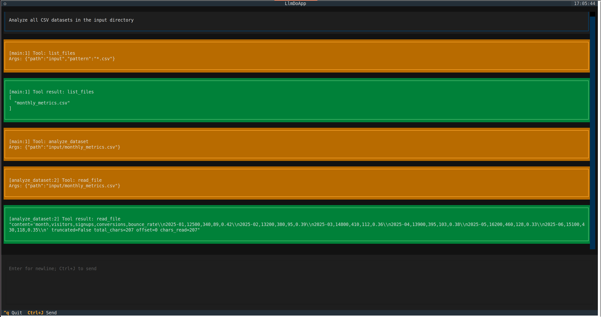
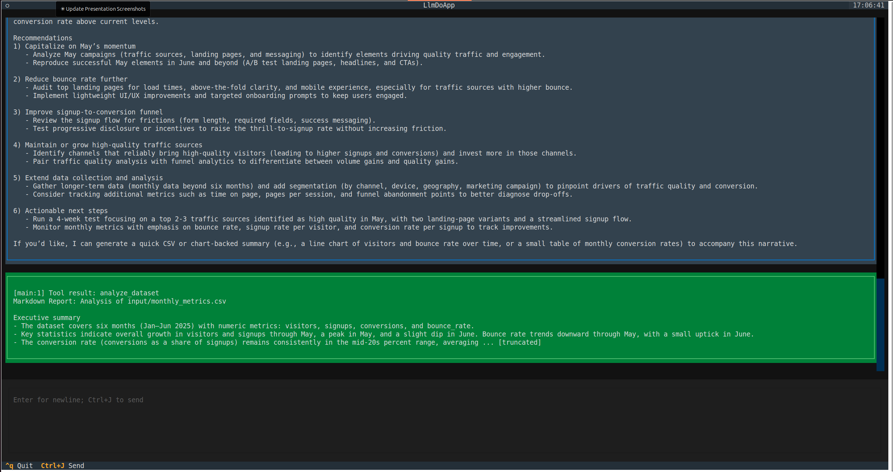
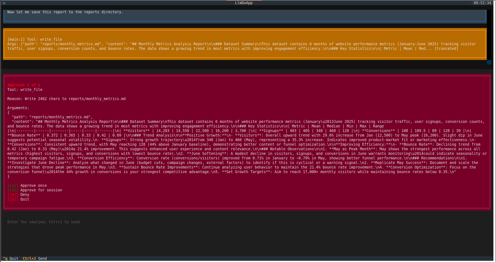
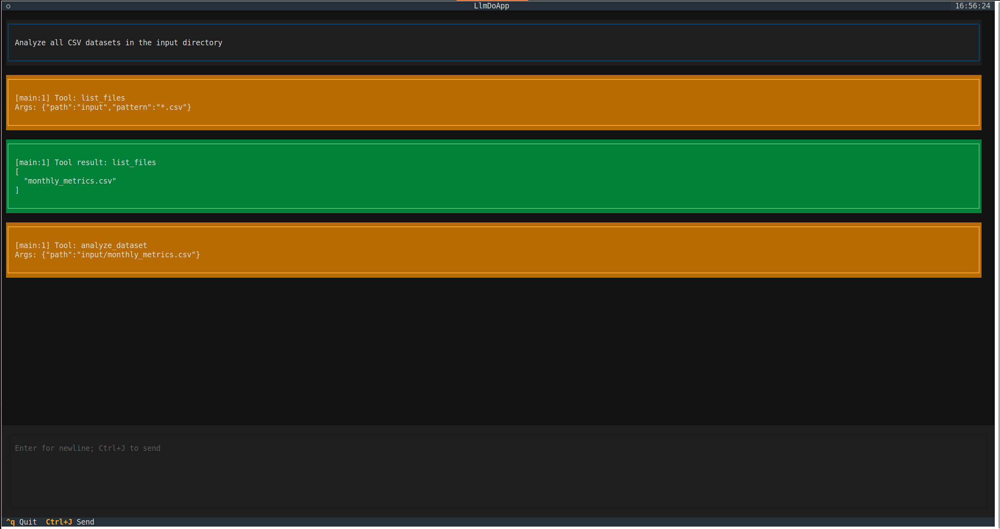
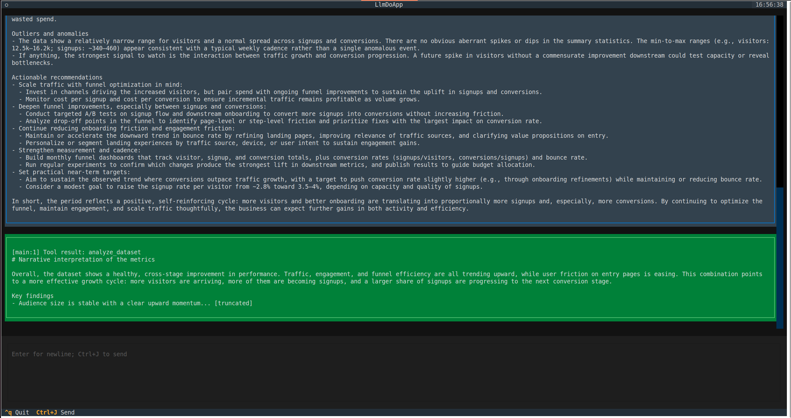

<!-- _class: title -->


# One Interface: Fluid Movement Between LLM and Code

**Zbigniew Łukasiak**
LLM Day 2026, Warsaw

---

## What is llm-do?

A **hybrid VM** and **recursive LLM harness** — a framework for building systems that combine LLM and code.

- Built on **PydanticAI**
- One interface for both LLM and code
- Designed for systems that **evolve** over time

**github.com/zby/llm-do**

---

## Prompts Are Like Code

You instruct, the machine executes.

- **Code**: you write precise instructions &rarr; computer executes deterministically
- **Prompts**: you describe intent &rarr; LLM executes stochastically

Both are ways of telling a computer what to do. One is precise, the other is flexible.

**This isn't a metaphor. LLMs can be formally modelled as probabilistic computers — and prompts are the way to program them.**

---

## The Hybrid Computer

Some tasks are better as prompts, some as code:

- **Code excels at**: deterministic logic, speed, precision, cost
- **Prompts excel at**: ambiguity, creativity, interpretation, flexibility

**Neither dominates.** You need both — and any real system uses both. This is **neuro-symbolic computing** — neural networks and traditional code, combined.

**If neither mode is sufficient alone, the question becomes: how do you combine them?**

---

## Why Recursive?

The standard agent loop is flat — LLM and tools alternate, but tools are always leaves:

```
LLM → tool → LLM → tool → LLM → done
```

But real tasks decompose fractally — a tool itself may need judgment, which needs another tool:

```
LLM decides what to analyze          (judgment)
  └─ Code reads and parses data      (mechanical)
       └─ LLM interprets anomalies   (judgment)
            └─ Code looks up history  (mechanical)
                 └─ LLM writes report (judgment)
```

**One layer of "LLM calls tools" only reaches level 1. Full power requires arbitrary interleaving.**

---


<!--
Visual pause: fractal self-similarity. The same structure repeats at every scale — just like real task decomposition, where any subtask can itself require the full interleaving of judgment and mechanical work.
-->

---

## Why Not a DSL?

Graph DSLs (LangGraph, etc.) start simple — nodes, edges, conditions. But arbitrary interleaving means you need:

- Loops, branching, error handling, recursion, dynamic dispatch...

Case by case, the DSL grows into a new programming language — without the tooling, debugging, or ecosystem of a real one.

**Better to start from the host language.** Python already has all of this. Use it directly.

---

## RLMs — The REPL

**Recursive Language Models** (Prime Intellect, Oct 2025) formalize this with an elegant approach: give the LLM a Python REPL.

```
Task (ambiguous → LLM)
├── Subtask A (mechanical → code)
├── Subtask B (judgment → LLM)
│   ├── Sub-B1 (lookup → code)
│   └── Sub-B2 (creative → LLM)
└── Subtask C (formatting → code)
```

The LLM writes code, the REPL executes it. Code orchestrates sub-agents (map-reduce), accumulating partial results in REPL variables — keeping data out of the LLM's context window.

The approach is elegantly simple: code is ephemeral and sandboxed, so there's no need to store code, manage approvals, or handle reentrant state.

---

## My Road — Evolution

> "I arrived at the same architecture independently — with a different priority."

**The goal**: Systems that grow and mature over time

> "Imagine a computer you extend by talking to it."

```
User describes intent → LLM performs it → Save as named capability
→ Observe patterns → Encode stable parts as code → Hybrid capability
```

**The priority**: enabling the system to **evolve**. Evolution means refactoring must be cheap. This is **llm-do**.

---

## The Key Differences

Same structural need — recursive dispatch. Different design choices.

|                            | RLM               | llm-do                      |
|----------------------------|--------------------|-----------------------------|
| **Focus**                  | Recursive dispatch | System evolution             |
| Code lifecycle             | Ephemeral          | Stored and evolved           |
| Data passing               | REPL variables     | Disk reads                   |
| Side effects               | None (sandboxed)   | Approvals + stateful tools   |

**RLMs are elegantly simple. llm-do trades that simplicity for evolvability and practical completeness.**

---

## The Key Differences — Why Not Ephemeral?

- **Benchmarks**: independent problems — nothing to reuse
- **Real software**: tools for a use case — code accumulates value
- **Universal tool?** Not yet — programs still serve specific purposes

<!--
Ephemeral code makes sense for benchmarks like OOLONG — each problem is independent, you solve it and discard. But real software is tools for a use case: Word for writing, a browser for the web, a data pipeline for your data. Code accumulates value because the use case persists. LLMs move us toward a "universal tool" — but we're not there yet. For the foreseeable future, we still build programs that serve specific purposes. Those programs deserve a codebase.
-->

---


<!--
Visual pause: tree rings. Each ring is a year of growth — each stabilization is a layer of accumulated value. Code that persists, tested, reused, built upon.
-->

---

## The Key Differences — The Core Design Choice

- **Unified calling convention** — LLM or code, invisible at the call site
- Refactoring across the boundary changes nothing for callers
- **Stateful tools + approval harness** — add complexity, but needed for real-world use

<!--
The key design choice is the unified calling convention: whether a capability is implemented as a prompt or as code must be invisible at the call site. This follows from evolvability — if logic migrates between prompt and code as patterns emerge, refactoring must be free. Stateful tools and the approval harness add further engineering complexity, but the unified interface is what makes progressive stabilization cheap.
-->

---

## llm-do Declarative Projects

A **project** is the analog of a program. Its elements:

- **Agents** (`.agent` files) — prompts with toolset declarations. Analog of functions.
- **Tools** (`.py` files) — Python code, also organized into toolsets.
- **Manifest** (`project.json`) — declares the elements, entry point, runtime config.

The same system can also be built entirely in Python code (still early stage). The declarative form makes it easier to inspect what the system can do.

---

## llm-do in Practice — A Data Reports Generator

The example: a system that analyzes CSV datasets and produces narrative reports.

- **Input**: a directory of CSV files (e.g. monthly website metrics)
- **Output**: markdown reports with statistics, trends, and interpretation

We'll build it twice — first as a pure LLM prototype, then stabilize the mechanical parts to code — and show that **the calling code doesn't change**.

---

## The Manifest

**Prototype manifest** (`examples/data_report/project.json`):
```json
{
  "version": 1,
  "runtime": { "max_depth": 3 },
  "entry": {
    "agent": "main",
    "args": {
      "input": "Analyze all CSV datasets in the input directory"
    }
  },
  "agent_files": ["main.agent", "analyze_dataset.agent"],
  "python_files": ["schemas.py"]
}
```

The stabilized version has the same structure, but `analyze_dataset.agent` is replaced by `tools.py` and `write_narrative.agent`.

---

## The Toolsets

`filesystem_project` is a built-in toolset: `list_files`, `read_file`, `write_file` — scoped to the project directory. Built-in toolsets don't need to be declared in the manifest.

`analyze_dataset` is another toolset — in V1 it's an LLM agent, in V2 it becomes code. **The caller doesn't know which.**

---

## The Orchestrator

**Prototype orchestrator** (`examples/data_report/main.agent`):
```yaml
---
name: main
description: Generate analysis reports for all CSV datasets.
toolsets:
  - analyze_dataset
  - filesystem_project
---

You generate analysis reports for CSV datasets.

1. Use `list_files("input", "*.csv")` to find all CSV files.
2. For each CSV file, call `analyze_dataset(path=<csv_path>)` to get the report
   and write it to `reports/<name>.md` using `write_file()`.
```

If you know Claude Code Skills — this is the same idea: YAML frontmatter + prompt. The difference is `toolsets` — and a toolset can be an LLM agent or code tools.

---

## The Analyzer — Version 1 (All LLM)

`examples/data_report/analyze_dataset.agent`:
```yaml
---
name: analyze_dataset
description: Analyze a CSV dataset and produce a narrative report.
input_model_ref: schemas.py:DatasetInput
toolsets:
  - filesystem_project
---

You are a data analyst. You will receive a path to a CSV file.

1. Read the CSV file using `read_file(path)`.
2. Compute summary statistics (mean, median, min, max) for numeric columns.
3. Identify notable trends and outliers.
4. Write a narrative markdown report with statistics, interpretation,
   and recommendations.
```

---

## Version 1 — Prototype Running



<!--
Prototype execution trace. The main agent (depth 1) calls list_files to find CSVs, then calls analyze_dataset. Since analyze_dataset is an LLM agent, it runs at depth 2 and calls read_file itself to read the raw CSV data. The LLM is doing everything — parsing, statistics, interpretation.
-->

---

## Version 1 — Prototype Result



<!--
The all-LLM result: a long narrative with statistics, trends, and recommendations. The LLM computed all the numbers itself — expensive and potentially inaccurate. This is the motivation for stabilization.
-->

---

## The Approval Harness



<!--
The approval dialog for write_file. The agent wants to write the report to disk — a side effect. The harness intercepts the call and shows the full content for review. Options: Approve, Approve for session, Deny, Quit. This is the trust boundary — every side-effectful tool call goes through it.
-->

---

## Version 1 — Room to Improve

**What the LLM is doing**:
- Reading and parsing CSV *(mechanical)*
- Computing statistics *(mechanical)*
- Identifying trends *(reasoning)*
- Writing narrative *(reasoning)*

Two of these are calculator work — deterministic, cheaper, and more reliable as code.

---

## Version 2 — Hybrid (Stabilized)

`examples/data_report_stabilized/tools.py`:
```python
@tools.tool
async def analyze_dataset(ctx, path: str) -> str:
    full_path = PROJECT_ROOT / path
    rows = list(csv.DictReader(open(full_path)))  # Code (mechanical)
    stats = _compute_summary(rows)                 # Code (mechanical)
    trends = _detect_trends(rows)                  # Code (mechanical)

    runtime = ctx.deps                             # LLM (reasoning)
    narrative = await runtime.call_agent(
        "write_narrative",
        {"input": f"Stats: {stats}\nTrends: {trends}"},
    )
    return narrative
```

**Same call. Same name. Same arguments.** The caller never knew it changed.
Code handles what's mechanical. LLM handles what needs interpretation.

---

## Version 2 — Stabilized Running



<!--
Stabilized execution trace. The main agent calls list_files and then analyze_dataset — same as before. But now analyze_dataset is a Python tool, not an LLM agent. Notice there's NO read_file call at depth 2 — the code reads the CSV directly. The only LLM call inside is write_narrative for interpretation.
-->

---

## Version 2 — Result



<!--
The stabilized result. The narrative is focused on interpretation because the mechanical work (parsing, statistics, trends) was done by code. Compare with the prototype result — same quality narrative, but statistics are computed deterministically.
-->

---

## Stabilizing and Softening

```
         ◄─────── SOFTEN ────────
         (add flexibility back)

Stochastic ─────────────────────► Deterministic
(flexible,                         (testable, fast,
 handles ambiguity)                 cheap, auditable)

         ─────── STABILIZE ──────►
         (extract patterns to code)
```

**Stabilize** when: patterns emerge, you need reliability, cost/latency matters

**Soften** when: edge cases multiply, requirements are fuzzy, you need to extend quickly

**The system breathes.** This is what "fluid movement" means — and the unified interface makes it cheap.

---

**Every piece you stabilize becomes** testable, faster, cheaper, and auditable.

**Progressive stabilization = progressive confidence.**

---

## Current Status

Research-grade. The concepts are ahead of the implementation.

But not vaporware — the repo includes 20+ working examples beyond what we showed today. The strongest part: **progressive stabilization and softening** — the unified calling convention that makes refactoring between LLM and code cheap.

---

<!-- _class: title -->

## One Slide Summary

> "One interface for LLM and code. Callers can't tell LLM from code. The system evolves."

---

## Resources

- **GitHub**: github.com/zby/llm-do
- **Theory**: `docs/theory.md` — stochastic computation model
- **Architecture**: `docs/architecture.md` — internal structure
- **Examples**: `examples/data_report*` — stabilization progression

**Questions?**

---

<!-- _class: title -->

# Backup Slides

---

## Backup: The Entry Point Patterns

Three orchestration styles:

1. **Agent entry** — LLM orchestrates
2. **Code entry** — Python orchestrates
3. **Orchestrating tool** — encapsulated workflow

---

## Backup: The Harness Pattern

Tool calls are intercepted like syscalls:

```
Agent/Code ──→ Harness ──→ Tool execution
                  │
           (approval check)
           (logging)
           (validation)
```

- **Approvals** block until permission granted
- **Observability** via message history, usage tracking
- **Your code owns control flow** (or LLM does — your choice)

---

## Backup: Approvals — Work in Progress

**Already working**: tools declare fine-grained approval requirements, agents declare which toolsets they use, every call goes through the harness. This is already far beyond RLMs, which have no approval model at all.

**Current limitation**: the reconciliation is coarse — the manifest sets one global `approval_mode`. Agent permissions and tool requirements aren't yet matched at a granular level.

**Next step**: a **capabilities-based** design — agents granted specific capabilities, tools requiring specific capabilities. An improvement, not a redesign.
